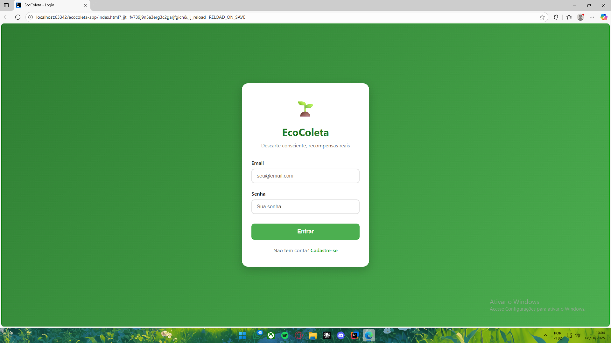
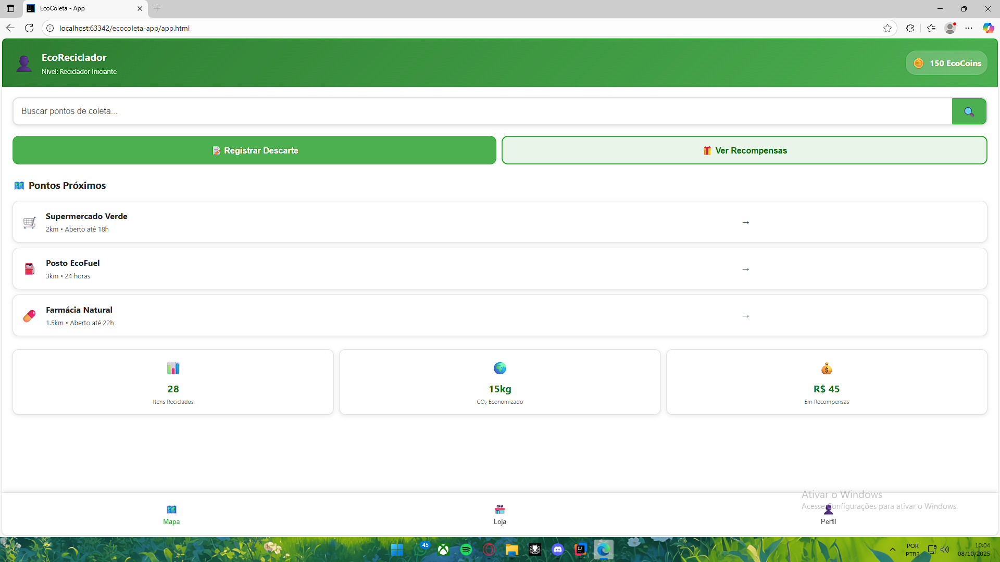
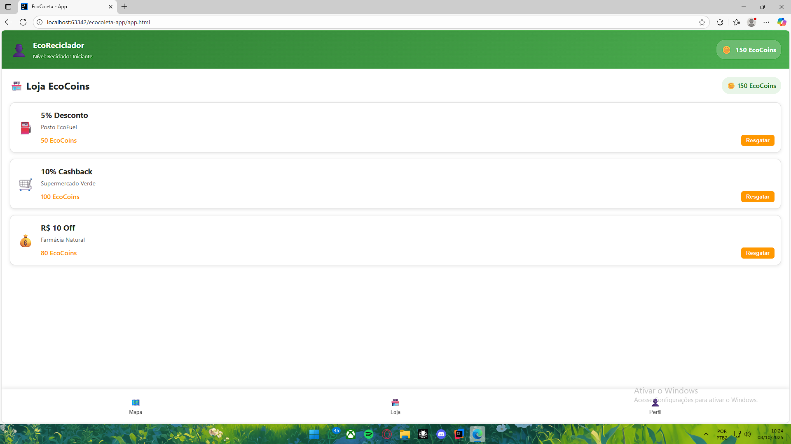

# EcoColeta - App de Descarte Consciente

## Descrição do Problema
A dificuldade da população em encontrar pontos de coleta seletiva e a falta de incentivos para o descarte correto resultam no aumento da poluição ambiental e no desperdício de
materiais recicláveis.

## Justificativa
O aplicativo promove o **ODS 12 (Consumo e Produção Responsáveis)** da ONU, facilitando o descarte correto através de um sistema de gamificação que recompensa os usuários com
benefícios reais como por exemplo descontos em mercados, casheback, desnconto em gasolina em farmacia.

## Público-Alvo
- População consciente interessada em reciclagem
- Moradores de áreas urbanas
- Jovens e adultos de 18-45 anos
- empresarios que queiram participar desse movimento ecologico.
- 
## Objetivos do App
Desenvolver um aplicativo móvel que incentive o descarte correto de resíduos através de um sistema de recompensas.

## Tipo de Aplicação
**PWA (Progressive Web App)**

## Como Usar
1. Acesse o app pelo navegador
2. Na tela de login, clique em "Entrar"
3. Navegue entre as telas usando o menu inferior
4. Clique em "Registrar Descarte" para simular reciclagem

## Screenshots

### Tela de Login
!

### Tela Principal - Geral

### Mapa de usuario

### Perfil do usuario

### Recompença

## 👨‍💻 Desenvolvedor
**[Carlos Henrique Santos Silva ]** - [Analise e Desenvolvimento de Sistemas] - EAD

## 📞 Contato
carlos.hs@sempreceub.com

---

*Desenvolvido para a disciplina de Programação para Dispositivos Móveis*